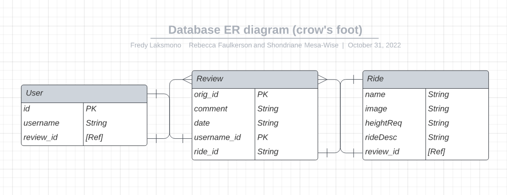
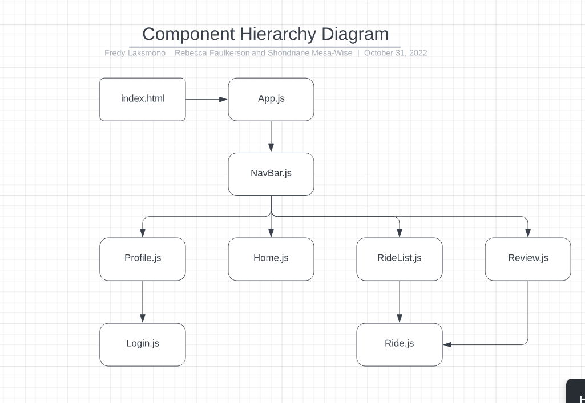

# Amusement-Park
## Date 10/19/22
### By: Shondriane Mesa-Wise, Rebecca Fulkerson and Fredy Laksmono

#### [Github Shondriane](https://github.com/shondriane) | [Github Rebecca](https://github.com/ralicynf) | [Github Fredy](https://github.com/fredy-laksmono) | [LinkedIn Shondriane](https://www.linkedin.com/in/shondriane-mesa-wise/) | [LinkedIn Rebecca](https://www.linkedin.com/in/fulkersonrebecca/) | [LinkedIn Fredy](https://www.linkedin.com/fredy-laksmono)

***

### ***Description***
The goal of the website is to provide users with knowledge of existing rides and read/write reviews by other amusement park guests.
***

### ***Technologies Used***

* HTML
* CSS
* Mongo
* Express
* React
* Node js

***

### ***Getting Started***
1. To get started, create an account first. Make a copy of the url provided or book mark it as that will be your unique url for the account.
2. User will get redirected to home to view a current list of rides.
3. You can read or post ride review.

A trello board used to keep track of development progress can be [viewed here](https://trello.com/b/KJMqQe2k/amusement-park).

The project itself was deployed and can be [viewed here]().

### ***Photos***

***

### ***Credits***

Markdown Guide: ia.net
Mongodb : [mongodb.com]
Express: [expressjs.com/en/guide/routing.html]
React:[https://reactjs.org/]
NodeJs: [https://nodejs.org/en/]
Lucid: [https://www.lucid/]
